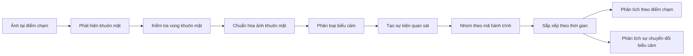
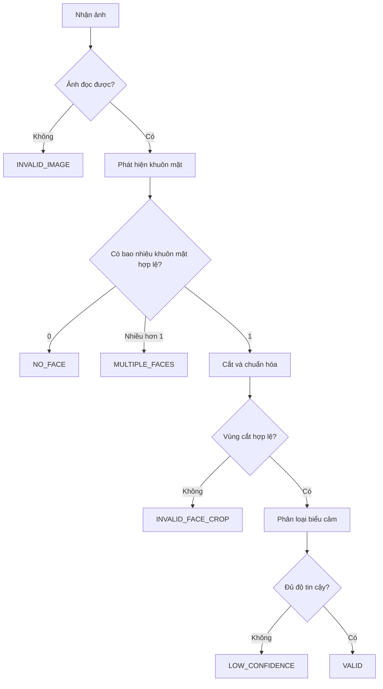
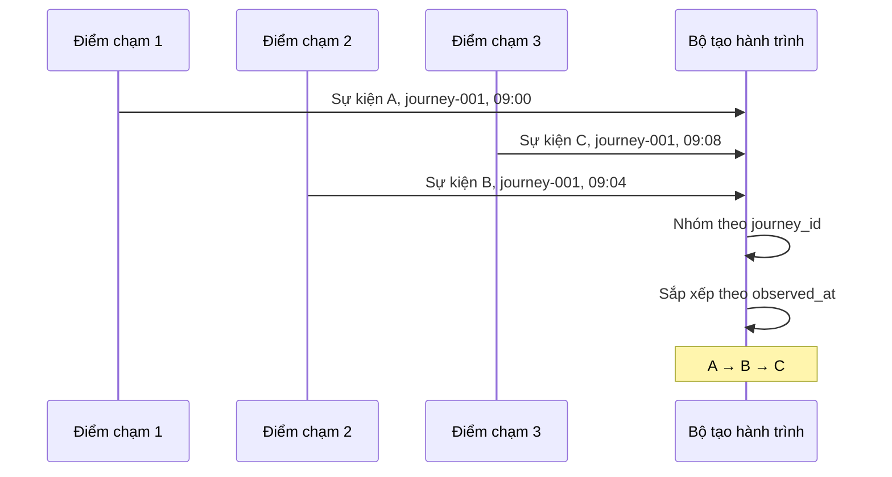

# CHƯƠNG 3. PHƯƠNG PHÁP ĐỀ XUẤT

> **Trạng thái:** Bản viết thử để duyệt cấu trúc và cách diễn đạt. Nội dung này chưa được đưa vào báo cáo LaTeX. Tên mô hình, tham số và hình có số liệu chỉ được hoàn thiện sau khi mã đã chạy và đầu ra đã được kiểm tra.

## 3.1. Tổng quan phương pháp đề xuất

Phương pháp đề xuất hướng tới việc thu nhận biểu cảm khuôn mặt tại các điểm chạm và tổ chức các quan sát này theo hành trình. Đầu vào của phương pháp là ảnh tại một điểm chạm, thời điểm quan sát và thông tin phiên tương ứng. Đầu ra gồm nhãn biểu cảm quan sát được, độ tin cậy của dự đoán và các thống kê mô tả sự phân bố, thay đổi biểu cảm giữa các điểm chạm.

Quy trình gồm hai phần chính. Phần thứ nhất xử lý ảnh tại từng điểm chạm để tạo ra sự kiện quan sát biểu cảm. Phần thứ hai liên kết các sự kiện có cùng mã hành trình, sắp xếp chúng theo thời gian và tính toán các đại lượng thống kê. Luồng xử lý tổng thể được trình bày tại Hình 3.1.

**Hình 3.1. Quy trình tổng thể của phương pháp đề xuất**

Phương pháp không thực hiện nhận dạng danh tính từ khuôn mặt. Việc xác định các quan sát thuộc cùng một hành trình dựa trên mã phiên ẩn danh do nguồn dữ liệu hoặc quy trình nghiệp vụ cung cấp. Khi không có mã phiên đáng tin cậy, dữ liệu chỉ được dùng để thống kê riêng tại từng điểm chạm và không được xem là hành trình của cùng một khách hàng.

Bảng 3.1 tóm tắt đầu vào và đầu ra của các công đoạn. Trong bản hoàn chỉnh, tên bộ phát hiện và bộ phân loại sẽ được điền theo đúng cấu hình đã được triển khai và kiểm tra.

| Công đoạn | Đầu vào | Đầu ra |
|---|---|---|
| Thu nhận dữ liệu | Ảnh, thời gian, mã điểm chạm, mã hành trình nếu có | Yêu cầu xử lý hợp lệ |
| Phát hiện khuôn mặt | Ảnh | Khung bao, điểm tin cậy và điểm mốc nếu mô hình hỗ trợ |
| Chuẩn hóa khuôn mặt | Vùng khuôn mặt | Ảnh đúng kích thước và định dạng của bộ phân loại |
| Phân loại biểu cảm | Ảnh khuôn mặt đã chuẩn hóa | Nhãn biểu cảm và độ tin cậy |
| Tạo sự kiện | Kết quả dự đoán và thông tin điểm chạm | Bản ghi quan sát biểu cảm |
| Hình thành hành trình | Các sự kiện có mã hành trình | Chuỗi sự kiện theo thời gian |
| Phân tích | Tập sự kiện và hành trình hợp lệ | Phân bố biểu cảm, ma trận chuyển tiếp và thống kê chất lượng dữ liệu |

**Bảng 3.1. Đầu vào và đầu ra của các công đoạn**

## 3.2. Nhận dạng biểu cảm tại một điểm chạm

### 3.2.1. Thu nhận và kiểm tra ảnh đầu vào

Mỗi yêu cầu xử lý tương ứng với một ảnh tại một điểm chạm. Ngoài dữ liệu ảnh, yêu cầu chứa mã sự kiện, mã điểm chạm, thời gian quan sát và mã hành trình nếu có. Mã sự kiện dùng để phát hiện bản ghi trùng lặp, trong khi mã điểm chạm xác định vị trí phát sinh quan sát. Thời gian quan sát phải bao gồm múi giờ để việc sắp xếp sự kiện không phụ thuộc vào cấu hình máy chạy.

Nếu dữ liệu ban đầu được lấy từ video, thành phần thu nhận chọn từng khung hình theo một quy tắc cố định trước khi chuyển vào quy trình. Mỗi khung hình được xử lý độc lập và tạo tối đa một sự kiện quan sát hợp lệ.

Ảnh đầu vào phải đọc được, có chiều rộng và chiều cao hợp lệ, đồng thời thuộc định dạng được hệ thống hỗ trợ. Ảnh không đọc được hoặc thiếu thông tin bắt buộc được ghi nhận là dữ liệu không hợp lệ. Hệ thống không bỏ qua lỗi vì số lượng ảnh lỗi là một phần của đánh giá chất lượng dữ liệu.

### 3.2.2. Phát hiện khuôn mặt

Bộ phát hiện khuôn mặt nhận ảnh đầu vào và trả về tập các khung bao cùng điểm tin cậy. Tên mô hình và cấu hình sử dụng trong bước này được xác định dựa trên kết quả thực nghiệm trình bày tại Chương 5. Tham số của bộ phát hiện được đọc từ tệp cấu hình thay vì viết trực tiếp trong mã xử lý, nhờ đó có thể truy vết chính xác cấu hình đã tạo ra mỗi kết quả.

Mỗi khung bao do bộ phát hiện tạo ra đi kèm một điểm thể hiện mức độ chắc chắn rằng vùng ảnh chứa khuôn mặt. Một phát hiện được xem là hợp lệ khi điểm này đạt mức tối thiểu đã quy định trong cấu hình của mô hình. Phiên bản đầu của phương pháp chỉ chấp nhận ảnh có đúng một khuôn mặt hợp lệ. Quy tắc này xuất phát từ yêu cầu mỗi sự kiện chỉ mô tả một chủ thể trong hành trình. Nếu không có khuôn mặt hợp lệ, hệ thống trả trạng thái không phát hiện được khuôn mặt. Nếu có nhiều hơn một khuôn mặt hợp lệ, hệ thống đánh dấu trường hợp nhiều khuôn mặt và không tự lựa chọn khuôn mặt lớn nhất, gần tâm ảnh nhất hoặc có điểm cao nhất. Việc tự lựa chọn trong trường hợp này có thể gắn kết quả của một người khác vào mã hành trình đang xử lý.

**Hình 3.2. Luồng xử lý một ảnh tại điểm chạm**

### 3.2.3. Cắt và chuẩn hóa ảnh khuôn mặt

Khung bao được giới hạn trong phạm vi ảnh trước khi cắt. Nếu bộ phát hiện cung cấp các điểm mốc khuôn mặt và bộ phân loại yêu cầu căn chỉnh, các điểm mốc được dùng để giảm sai khác về vị trí và góc nghiêng. Vùng cắt rỗng, có kích thước không hợp lệ hoặc không đạt điều kiện đầu vào của bộ phân loại bị loại và được ghi nhận bằng một mã trạng thái riêng.

Ảnh khuôn mặt sau đó được thay đổi kích thước, số kênh màu và miền giá trị điểm ảnh theo đúng yêu cầu của mô hình phân loại. Quy trình không áp dụng thêm bộ lọc làm đẹp hoặc biến đổi ảnh không xuất hiện trong tài liệu và cấu hình của mô hình. Cách chuẩn hóa phải giống giữa quá trình kiểm thử mô hình và quá trình vận hành hệ thống.

### 3.2.4. Phân loại biểu cảm

Bộ phân loại nhận ảnh khuôn mặt đã chuẩn hóa và trả về bảy giá trị tương ứng với các lớp Angry, Disgust, Fear, Happy, Sad, Surprise và Neutral. Nhãn dự đoán là lớp có xác suất lớn nhất. Độ tin cậy là xác suất tương ứng với nhãn này.

Gọi véc-tơ đầu ra của bộ phân loại là

$$
\mathbf{p}=[p_1,p_2,\ldots,p_7],
\qquad \sum_{k=1}^{7}p_k=1.
$$

Nhãn dự đoán được xác định bởi

$$
\hat{y}=\operatorname*{arg\,max}_{k\in\{1,\ldots,7\}}p_k.
$$

Véc-tơ xác suất đầy đủ được giữ trong kết quả kỹ thuật để kiểm tra đầu ra và phân tích lỗi. Dữ liệu chính dùng cho phân tích hành trình chỉ gồm nhãn dự đoán, độ tin cậy và trạng thái chất lượng. Phương pháp không gán trọng số số học cho các lớp và không chuyển véc-tơ xác suất thành một điểm cảm xúc tổng hợp.

Nếu độ tin cậy thấp hơn ngưỡng vận hành, kết quả được đánh dấu `LOW_CONFIDENCE` và không tham gia thống kê biểu cảm. Trường hợp này không được tự động đổi thành lớp Neutral, bởi độ tin cậy thấp thể hiện sự không chắc chắn của mô hình chứ không chứng minh khuôn mặt mang biểu cảm trung tính.

## 3.3. Biểu diễn sự kiện quan sát

Một ảnh được xử lý thành công tạo ra một sự kiện quan sát. Cấu trúc sự kiện phải lưu đủ thông tin để xác định nguồn dữ liệu, kết quả dự đoán và phiên bản mô hình đã sử dụng. Các trường chính được trình bày tại Bảng 3.2.

| Trường | Nội dung |
|---|---|
| `event_id` | Mã duy nhất của sự kiện |
| `journey_id` | Mã phiên ẩn danh, có thể để trống |
| `touchpoint_id` | Mã điểm chạm |
| `observed_at` | Thời điểm quan sát có múi giờ |
| `predicted_label` | Nhãn biểu cảm dự đoán |
| `confidence` | Độ tin cậy của nhãn dự đoán |
| `quality_status` | Trạng thái xử lý dữ liệu |
| `detector_version` | Phiên bản bộ phát hiện |
| `classifier_version` | Phiên bản bộ phân loại |

**Bảng 3.2. Cấu trúc sự kiện quan sát biểu cảm**

Các trạng thái xử lý được chuẩn hóa để mọi ảnh đầu vào đều có kết quả truy vết. `VALID` biểu thị một quan sát đủ điều kiện sử dụng. Các trạng thái còn lại chỉ ra nguyên nhân ảnh bị loại, gồm ảnh không hợp lệ, không phát hiện được khuôn mặt, có nhiều khuôn mặt, vùng cắt không hợp lệ, độ tin cậy thấp hoặc lỗi mô hình. Việc lưu riêng các trạng thái này cho phép tính tỷ lệ dữ liệu không sử dụng được thay vì chỉ báo cáo trên các trường hợp xử lý thành công.

Trong cấu trúc trên, `journey_id` không chứa thông tin nhận dạng cá nhân. Mã này được cung cấp bởi nguồn dữ liệu hoặc quy trình nghiệp vụ đã được xác định trước. Ảnh khuôn mặt và đặc trưng khuôn mặt không được dùng để tự tạo hoặc khôi phục mã hành trình.

## 3.4. Hình thành hành trình đa điểm chạm

### 3.4.1. Điều kiện liên kết sự kiện

Các sự kiện chỉ được liên kết khi có cùng mã hành trình hợp lệ. Những sự kiện không có mã hành trình vẫn được giữ để thống kê biểu cảm tại điểm chạm nhưng không tham gia phân tích chuyển đổi giữa các điểm chạm. Quy tắc này phân tách rõ hai mức phân tích: mức điểm chạm và mức hành trình.

Trong mỗi hành trình, các sự kiện được sắp xếp tăng dần theo thời gian quan sát. Khi hai sự kiện có cùng thời điểm, thứ tự điểm chạm đã khai báo trong cấu hình được sử dụng để phân giải. Nếu thời gian và thứ tự điểm chạm vẫn không đủ xác định vị trí, cặp sự kiện được đánh dấu xung đột và không tham gia phép tính chuyển tiếp.

**Hình 3.3. Hình thành hành trình từ các sự kiện điểm chạm**

### 3.4.2. Xử lý dữ liệu thiếu và trùng lặp

Danh sách và thứ tự điểm chạm mong đợi được khai báo trong cấu hình. Sau khi hình thành hành trình, hệ thống đối chiếu các điểm chạm đã quan sát với danh sách này để xác định dữ liệu bị thiếu. Một điểm chạm thiếu chỉ được ghi nhận là thiếu; phương pháp không tự sinh sự kiện hoặc nội suy nhãn biểu cảm.

Hai bản ghi có cùng `event_id` được xem là trùng lặp. Hệ thống chỉ giữ bản ghi đầu tiên trong kết quả xử lý và ghi lại lỗi trùng lặp. Hai sự kiện khác mã nhưng có cùng biểu cảm không được coi là trùng, vì một hành trình có thể phát sinh nhiều quan sát giống nhau tại các thời điểm khác nhau.

Nếu không có cơ chế cung cấp mã hành trình đáng tin cậy, phương pháp dừng ở mức thống kê từng điểm chạm. Trong trường hợp đó, báo cáo không sử dụng các cụm từ “theo dõi khách hàng qua nhiều camera” hoặc “hành trình của cùng một khách hàng”.

## 3.5. Phân tích hành trình biểu cảm

### 3.5.1. Phân bố biểu cảm tại từng điểm chạm

Phân bố biểu cảm mô tả số lượng và tỷ lệ các nhãn hợp lệ tại một điểm chạm. Gọi $T_i$ là điểm chạm, $Y_i$ là nhãn và $Q_i$ là trạng thái của quan sát thứ $i$. Số quan sát lớp $k$ tại điểm chạm $t$ được tính bởi

$$
n_{t,k}=\sum_i
\mathbf{1}(T_i=t\land Y_i=k\land Q_i=\mathrm{VALID}).
$$

Tỷ lệ lớp $k$ tại điểm chạm $t$ là

$$
r_{t,k}=\frac{n_{t,k}}{\sum_{j=1}^{7}n_{t,j}}.
$$

Khi điểm chạm không có quan sát hợp lệ, tỷ lệ không được tính và phải báo số mẫu bằng không. Việc điền tỷ lệ `0%` cho từng lớp trong trường hợp này có thể khiến người đọc hiểu nhầm rằng hệ thống đã quan sát nhưng không gặp các biểu cảm đó.

Kết quả được thể hiện bằng bảng số lượng và biểu đồ cột chồng. Mỗi biểu đồ phải ghi tổng số quan sát hợp lệ tại từng điểm chạm để người đọc đánh giá được quy mô dữ liệu.

### 3.5.2. Ma trận chuyển tiếp giữa các biểu cảm

Đối với hai điểm chạm liên tiếp $u$ và $v$, ma trận chuyển tiếp ghi nhận sự thay đổi nhãn biểu cảm trong các hành trình có dữ liệu hợp lệ ở cả hai điểm. Mỗi hàng biểu diễn nhãn tại điểm chạm trước và mỗi cột biểu diễn nhãn tại điểm chạm sau.

Số hành trình chuyển từ lớp $a$ sang lớp $b$ được xác định bởi

$$
N_{a,b}^{u\rightarrow v}
=\sum_s
\mathbf{1}(Y_{s,u}=a\land Y_{s,v}=b),
$$

trong đó $s$ là một hành trình đủ dữ liệu tại cả $u$ và $v$. Tỷ lệ chuyển đổi theo hàng được tính bởi

$$
P_{a,b}^{u\rightarrow v}
=\frac{N_{a,b}^{u\rightarrow v}}
{\sum_{j=1}^{7}N_{a,j}^{u\rightarrow v}}.
$$

Nếu một hàng không có hành trình đủ điều kiện, tỷ lệ của hàng đó để trống thay vì điền bằng không. Ma trận được tính riêng cho từng cặp điểm chạm liên tiếp, tránh trộn các chuyển đổi xảy ra trong những bối cảnh khác nhau.

| Điểm chạm trước → điểm chạm sau | Happy | Neutral | Angry |
|---|---:|---:|---:|
| Happy | 12 | 4 | 1 |
| Neutral | 5 | 15 | 3 |
| Angry | 1 | 2 | 6 |

**Bảng 3.3. Ví dụ minh họa cách đọc ma trận chuyển tiếp**

Các số trong Bảng 3.3 chỉ dùng để minh họa cấu trúc, không phải kết quả thực nghiệm. Chẳng hạn, ô thuộc hàng Neutral và cột Angry biểu thị số hành trình có nhãn Neutral tại điểm chạm trước và Angry tại điểm chạm sau. Ma trận cho biết mẫu thay đổi xuất hiện trong dữ liệu, nhưng không chứng minh điểm chạm sau là nguyên nhân gây ra thay đổi biểu cảm.

### 3.5.3. Đánh giá chất lượng dữ liệu hành trình

Bên cạnh phân bố biểu cảm, phương pháp thống kê chất lượng dữ liệu để tránh đưa ra nhận xét từ một tập quan sát không đầy đủ. Các đại lượng gồm tổng số ảnh đầu vào, số quan sát hợp lệ, số ảnh không phát hiện được khuôn mặt, số ảnh có nhiều khuôn mặt, số kết quả có độ tin cậy thấp, số hành trình thiếu điểm chạm và số cặp sự kiện bị xung đột thứ tự.

Tỷ lệ quan sát hợp lệ được tính trên toàn bộ ảnh đầu vào, không chỉ trên các ảnh mà mô hình xử lý thành công. Tương tự, mẫu số của mỗi ma trận chuyển tiếp phải là số hành trình có đủ dữ liệu tại đúng cặp điểm chạm đang xét. Các mẫu số này được trình bày kèm bảng và biểu đồ để người đọc đánh giá mức độ tin cậy của thống kê.

Phương pháp không tổng hợp bảy lớp biểu cảm thành một điểm số chung cho toàn hành trình. Các lớp biểu cảm là dữ liệu phân loại và không có sẵn khoảng cách số học để cộng hoặc lấy trung bình. Kết quả phân tích được giữ ở mức phân bố, chuyển đổi và chất lượng dữ liệu. Mọi diễn giải về mức độ hài lòng hoặc nguyên nhân của thay đổi biểu cảm cần thêm dữ liệu và thiết kế nghiên cứu riêng.

---

## Các vị trí phải thay thế sau khi có mã và đầu ra

1. Điền tên, phiên bản, nguồn trọng số và tham số của bộ phát hiện khuôn mặt.
2. Điền tên, phiên bản, nguồn trọng số và quy trình tiền xử lý của bộ phân loại biểu cảm.
3. Thay sơ đồ Mermaid bằng hình TikZ hoặc PDF/SVG có định dạng thống nhất với báo cáo.
4. Thay bảng trạng thái bằng đúng mã trạng thái đã được triển khai.
5. Đối chiếu công thức thống kê với mã và bộ kiểm thử tính tay.
6. Chuyển các biểu đồ có số liệu sang Chương 5; không để số liệu minh họa trong bản chính thức.
7. Bổ sung tham chiếu chéo tới các bảng kết quả tương ứng ở Chương 5.
