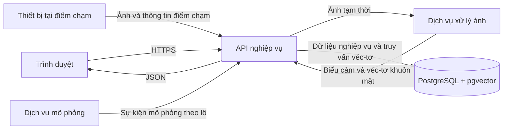

# Đặc tả kỹ thuật hệ thống CRM và phân tích biểu cảm đa điểm chạm

## 1. Trạng thái tài liệu

- **Phiên bản:** 0.2, cập nhật theo mã đã triển khai
- **Mục đích:** Ghi lại hợp đồng kỹ thuật của phiên bản demo đang chạy
- **Phạm vi:** Giao diện CRM, API nghiệp vụ, dịch vụ xử lý ảnh, dịch vụ mô phỏng và cơ sở dữ liệu
- **Thay thế giả định cũ:** Hệ thống không còn nhận `journey_id` từ nguồn bên ngoài. Hành trình được tạo từ khách hàng đã nhận dạng và quy tắc lượt ghé thăm.

Tệp `PROPOSED_METHOD/TECH_SPEC.md` mô tả một thử nghiệm cũ không nhận dạng danh tính. Không dùng tệp đó để triển khai hệ thống CRM này.

## 2. Mục tiêu kỹ thuật

Hệ thống phải:

1. Quản lý khách hàng, dữ liệu mua hàng và điểm chạm trong một cửa hàng.
2. Quản lý nhóm sản phẩm, sản phẩm và thông tin sản phẩm tại thời điểm mua.
3. Nhận ảnh tại một điểm chạm và tạo kết quả biểu cảm bảy lớp.
4. Tìm khách hàng đã đăng ký bằng véc-tơ đặc trưng khuôn mặt.
5. Nhóm các bản ghi của cùng khách hàng vào đúng lượt ghé thăm.
6. Cho phép xem lại hành trình theo thứ tự thời gian.
7. Tạo thống kê phân bố biểu cảm và bảng thay đổi nhãn giữa các điểm chạm.
8. Theo dõi biến thiên nhãn trong cùng ngày, cùng khu vực và khoảng thời gian đã chọn.
9. Bảo vệ dữ liệu khuôn mặt bằng đồng ý sử dụng, phân quyền và nhật ký truy cập.

## 3. Ngoài phạm vi

- Không xác định danh tính người chưa đăng ký.
- Không theo dõi một người bằng quần áo, dáng đi hoặc đặc điểm cơ thể.
- Không xử lý luồng video trong phiên bản đầu.
- Không huấn luyện kiến trúc học sâu mới.
- Không tính điểm cảm xúc chung hoặc mức độ hài lòng.
- Không suy diễn nguyên nhân thay đổi biểu cảm.
- Không lưu ảnh truy vấn mặc định.
- Không xây dựng màn hình quản lý tài khoản người dùng hoặc thay đổi vai trò. Tài khoản ban đầu được tạo bằng dữ liệu khởi tạo của hệ thống.
- Không tích hợp camera vật lý trong phiên bản đầu. Dịch vụ mô phỏng dùng đường dẫn theo lô riêng và mọi bản ghi phải có `source_type=SIMULATOR` cùng `simulation_run_id`.

## 4. Kiến trúc



### 4.1. Ranh giới trách nhiệm

#### Giao diện `web`

- Thu thập dữ liệu nhập và hiển thị kết quả.
- Không tự quyết định quyền truy cập.
- Không tự tính báo cáo chính thức.
- Không giữ ảnh tải lên sau khi yêu cầu kết thúc.

#### API `api`

- Xác thực và phân quyền.
- Kiểm tra dữ liệu nghiệp vụ.
- Gọi dịch vụ `vision`.
- Đối sánh véc-tơ với mẫu khách hàng.
- Tạo lượt ghé thăm và bản ghi quan sát.
- Tạo truy vấn báo cáo.
- Ghi nhật ký thao tác.

#### Dịch vụ `vision`

- Kiểm tra và giải mã ảnh.
- Phát hiện/căn chỉnh khuôn mặt.
- Phân loại biểu cảm.
- Tạo véc-tơ ArcFace.
- Không truy cập bảng khách hàng và không tự kết luận danh tính.
- Không lưu ảnh hoặc véc-tơ sau khi trả kết quả.

#### Dịch vụ `simulator`

- Chỉ tạo đúng 100 khách hàng trong một lần chạy demo.
- Tạo lượt ghé thăm, quan sát, trường hợp lỗi và đơn hàng bằng hạt giống cố định.
- Gửi dữ liệu qua API nghiệp vụ, không ghi trực tiếp vào PostgreSQL.
- Đánh dấu rõ nguồn mô phỏng để không bị dùng như đầu ra mô hình thật.

#### PostgreSQL

- Lưu dữ liệu quan hệ.
- Lưu véc-tơ mẫu khuôn mặt.
- Thực hiện tìm kiếm theo khoảng cách cosine.
- Bảo đảm ràng buộc duy nhất và giao dịch khi tạo lượt ghé thăm.

## 5. Ngăn xếp công nghệ

| Thành phần | Công nghệ | Lý do dùng trong hệ thống |
|---|---|---|
| `web` | React + TypeScript + Vite | Chia giao diện thành thành phần và kiểm tra kiểu dữ liệu khi phát triển |
| Thành phần giao diện | Ant Design | Có sẵn bảng, biểu mẫu, tải ảnh và hộp thoại quản trị |
| Gọi API | TanStack Query | Quản lý trạng thái tải, lỗi, lưu tạm và làm mới dữ liệu máy chủ |
| Biểu đồ | Apache ECharts | Hỗ trợ biểu đồ cột và bản đồ nhiệt |
| `api` | FastAPI | Khai báo dữ liệu vào/ra và sinh tài liệu OpenAPI |
| Truy cập dữ liệu | SQLAlchemy 2 + Alembic | Ánh xạ bảng và quản lý thay đổi schema |
| `vision` | PyTorch + OpenCV | Chạy mô hình và xử lý ảnh |
| Phát hiện | RetinaFace-MobileNet0.25 | Cấu hình đã được đo trong benchmark detector của luận văn |
| Biểu cảm | Mô hình Emotion trong DeepFace | Cung cấp đầu ra bảy lớp cần dùng trong phiên bản đầu |
| Đặc trưng khuôn mặt | ArcFace | Tạo véc-tơ dùng cho đối sánh khách hàng đã đăng ký |
| Dữ liệu | PostgreSQL + pgvector | Lưu dữ liệu CRM và tìm kiếm véc-tơ trong cùng hệ quản trị |
| Đóng gói | Docker Compose | Cố định môi trường chạy các dịch vụ khi phát triển và kiểm thử |

Phiên bản chính xác phải được khóa trong `uv.lock` hoặc tệp khóa tương đương của Python và `package-lock.json` của giao diện.

## 6. Mô hình dữ liệu

Tất cả khóa chính dùng UUID. Tất cả thời gian lưu theo UTC bằng kiểu `timestamptz`; giao diện chuyển sang múi giờ cấu hình của hệ thống.

### 6.1. `users`

| Trường | Kiểu | Quy tắc |
|---|---|---|
| `id` | UUID | Khóa chính |
| `email` | text | Duy nhất, chuyển chữ thường trước khi lưu |
| `password_hash` | text | Không lưu mật khẩu rõ |
| `full_name` | text | Bắt buộc |
| `role` | enum | `ADMIN`, `MANAGER`, `STAFF` |
| `status` | enum | `ACTIVE`, `DISABLED` |
| `created_at`, `updated_at` | timestamptz | Do máy chủ tạo |

### 6.2. `customers`

| Trường | Kiểu | Quy tắc |
|---|---|---|
| `id` | UUID | Khóa chính |
| `customer_code` | text | Duy nhất, không đổi sau khi tạo |
| `full_name` | text | Bắt buộc |
| `phone` | text | Có thể để trống; chuẩn hóa trước khi tìm kiếm |
| `email` | text | Có thể để trống; chuyển chữ thường |
| `status` | enum | `ACTIVE`, `INACTIVE` |
| `face_consent` | boolean | Mặc định `false` |
| `face_consent_at` | timestamptz | Bắt buộc khi `face_consent=true` |
| `created_at`, `updated_at` | timestamptz | Do máy chủ tạo |

Không dùng `face_consent` làm bằng chứng pháp lý duy nhất; hệ thống phải ghi người thực hiện và thời gian thay đổi trong nhật ký.

### 6.3. `face_templates`

| Trường | Kiểu | Quy tắc |
|---|---|---|
| `id` | UUID | Khóa chính |
| `customer_id` | UUID | Tham chiếu `customers` |
| `embedding` | vector(512) | Véc-tơ ArcFace đã chuẩn hóa |
| `model_name` | text | Ví dụ `ArcFace` |
| `model_version` | text | Bắt buộc |
| `quality_score` | double precision | Chỉ dùng kiểm tra chất lượng mẫu, không phải độ giống |
| `active` | boolean | Mặc định `true` |
| `created_by` | UUID | Người đăng ký mẫu |
| `created_at` | timestamptz | Do máy chủ tạo |

Không lưu ảnh đăng ký trong bảng này. Nếu sau này cần lưu ảnh, phải có đặc tả lưu trữ và thời hạn xóa riêng.

### 6.4. `touchpoints`

| Trường | Kiểu | Quy tắc |
|---|---|---|
| `id` | UUID | Khóa chính |
| `touchpoint_code` | text | Duy nhất trong hệ thống |
| `name` | text | Bắt buộc |
| `sequence_order` | integer | Thứ tự nghiệp vụ, lớn hơn hoặc bằng 0 |
| `active` | boolean | Mặc định `true` |

`touchpoint_code` và `sequence_order` đều có ràng buộc duy nhất. Phiên bản này chỉ phục vụ một cửa hàng nên không có `store_id` hoặc bảng chi nhánh.

### 6.5. `visits`

| Trường | Kiểu | Quy tắc |
|---|---|---|
| `id` | UUID | Khóa chính |
| `customer_id` | UUID | Khách hàng đã nhận dạng |
| `started_at` | timestamptz | Thời điểm quan sát hợp lệ đầu tiên |
| `last_seen_at` | timestamptz | Thời điểm mới nhất đã nhận |
| `ended_at` | timestamptz | Trống khi lượt còn hoạt động |
| `status` | enum | `ACTIVE`, `CLOSED` |
| `close_reason` | enum | `TIMEOUT`, `MANUAL`, `NEW_VISIT`, có thể trống |
| `created_at`, `updated_at` | timestamptz | Do máy chủ tạo |

Tại một thời điểm chỉ có tối đa một lượt `ACTIVE` cho một khách hàng. Ràng buộc này phải được bảo vệ bằng chỉ mục duy nhất có điều kiện và giao dịch cơ sở dữ liệu.

### 6.6. `observations`

| Trường | Kiểu | Quy tắc |
|---|---|---|
| `id` | UUID | Khóa chính |
| `event_id` | text | Duy nhất, do nguồn gửi tạo |
| `touchpoint_id` | UUID | Bắt buộc và phải đang hoạt động |
| `observed_at` | timestamptz | Thời gian nguồn ghi ảnh |
| `received_at` | timestamptz | Thời gian API nhận yêu cầu |
| `customer_id` | UUID | Có thể trống khi không xác định |
| `visit_id` | UUID | Có thể trống; chỉ có khi đã xác định khách hàng |
| `expression_label` | enum | Có thể trống nếu xử lý lỗi |
| `expression_confidence` | double precision | Trong khoảng `[0,1]` |
| `expression_scores` | jsonb | Bảy xác suất để kiểm tra kỹ thuật |
| `face_match_distance` | double precision | Có thể trống |
| `image_status` | enum | Kết quả kiểm tra và phát hiện khuôn mặt |
| `expression_status` | enum | Kết quả phân loại biểu cảm |
| `identity_status` | enum | Kết quả nhận dạng khách hàng |
| `source_type` | text | `CAMERA` hoặc `SIMULATOR` |
| `simulation_run_id` | text | Có giá trị với dữ liệu mô phỏng |
| `detector_version` | text | Phiên bản detector |
| `emotion_model_version` | text | Phiên bản mô hình biểu cảm |
| `recognition_model_version` | text | Phiên bản ArcFace |
| `created_at` | timestamptz | Do máy chủ tạo |

Ảnh đầu vào không được lưu trong `observations`.

### 6.7. `product_categories` và `products`

`product_categories` gồm: `id`, `category_code`, `name`, `description`, `active`, `created_at`, `updated_at`. `category_code` là duy nhất.

`products` gồm:

| Trường | Kiểu | Quy tắc |
|---|---|---|
| `id` | UUID | Khóa chính |
| `sku` | text | Mã sản phẩm duy nhất và không đổi sau khi tạo |
| `name` | text | Bắt buộc |
| `category_id` | UUID | Tham chiếu nhóm sản phẩm |
| `description` | text | Có thể để trống |
| `current_price` | numeric(14,2) | Không âm |
| `status` | enum | `ACTIVE`, `INACTIVE` |
| `created_at`, `updated_at` | timestamptz | Do máy chủ tạo |

Sản phẩm đã có trong đơn hàng không được xóa cứng. Trạng thái `INACTIVE` ngăn đưa sản phẩm vào đơn hàng mới nhưng không làm mất lịch sử cũ.

### 6.8. `orders` và `order_items`

`orders` gồm: `id`, `external_code`, `customer_id`, `visit_id` có thể trống, `ordered_at`, `total_amount`, `status`, `created_at`, `updated_at`.

`order_items` gồm: `id`, `order_id`, `product_id`, `product_code_snapshot`, `product_name_snapshot`, `quantity`, `unit_price`, `line_total`.

Tên, mã và đơn giá được sao chép vào dòng đơn hàng tại thời điểm mua. Vì vậy, sửa tên hoặc giá hiện tại của sản phẩm không làm thay đổi lịch sử mua hàng. Máy chủ kiểm tra `line_total = quantity * unit_price` và `orders.total_amount` bằng tổng các dòng. Không tin tổng tiền do giao diện gửi lên.

### 6.9. `audit_logs`

| Trường | Kiểu | Nội dung |
|---|---|---|
| `id` | UUID | Khóa chính |
| `actor_user_id` | UUID | Người thực hiện |
| `action` | text | Loại thao tác |
| `entity_type`, `entity_id` | text, UUID | Đối tượng bị tác động |
| `request_id` | text | Mã theo dõi yêu cầu |
| `metadata` | jsonb | Không chứa ảnh, mật khẩu hoặc véc-tơ |
| `created_at` | timestamptz | Thời điểm thao tác |

## 7. Giá trị liệt kê

### 7.1. Nhãn biểu cảm

`ANGRY`, `DISGUST`, `FEAR`, `HAPPY`, `SAD`, `SURPRISE`, `NEUTRAL`.

Thứ tự ánh xạ với mô hình phải nằm trong một tệp cấu hình có kiểm thử. Không suy ra thứ tự từ thứ tự khóa của đối tượng JSON.

### 7.2. Trạng thái xử lý ảnh

`image_status` nhận một trong các giá trị:

- `VALID`: có đúng một khuôn mặt hợp lệ.
- `INVALID_IMAGE`: không giải mã được ảnh.
- `NO_FACE`: không phát hiện khuôn mặt đạt điều kiện.
- `MULTIPLE_FACES`: có nhiều hơn một khuôn mặt hợp lệ.
- `INVALID_FACE_CROP`: vùng khuôn mặt sau cắt/căn chỉnh không hợp lệ.
- `MODEL_ERROR`: detector không chạy được.

Yêu cầu thiếu trường hoặc sai định dạng bị từ chối trước khi tạo quan sát và trả mã lỗi `INVALID_INPUT` ở lớp API.

### 7.3. Trạng thái phân loại biểu cảm

`expression_status` gồm `VALID`, `LOW_CONFIDENCE`, `ERROR`, `NOT_RUN`. Chỉ bản ghi `VALID` mới tham gia thống kê phân bố và thay đổi nhãn.

### 7.4. Trạng thái nhận dạng khách hàng

`identity_status` gồm `MATCHED`, `NO_MATCH`, `DISABLED`, `ERROR`, `NOT_RUN`.

Ba trạng thái được tách riêng vì ảnh có thể tạo được nhãn biểu cảm nhưng không nhận dạng được khách hàng. Trường hợp đó vẫn tham gia thống kê tại điểm chạm nhưng không được tạo hành trình cá nhân.

## 8. Hợp đồng API

Tiền tố chung: `/api/v1`. Dữ liệu JSON dùng `snake_case`. Thời gian dùng ISO 8601 có múi giờ. Danh sách dùng phân trang `page`, `page_size`, `total`.

### 8.1. Xác thực

| Phương thức | Đường dẫn | Chức năng |
|---|---|---|
| `POST` | `/auth/login` | Đăng nhập |
| `POST` | `/auth/refresh` | Làm mới phiên |
| `POST` | `/auth/logout` | Kết thúc phiên |
| `GET` | `/auth/me` | Lấy người dùng hiện tại |

Mã truy cập và mã làm mới đặt trong cookie `HttpOnly`, `Secure`, `SameSite=Lax`. Các yêu cầu thay đổi dữ liệu phải kiểm tra mã chống giả mạo yêu cầu.

### 8.2. Khách hàng

| Phương thức | Đường dẫn | Chức năng |
|---|---|---|
| `GET` | `/customers` | Danh sách, lọc và tìm kiếm |
| `POST` | `/customers` | Tạo khách hàng |
| `GET` | `/customers/{customer_id}` | Chi tiết khách hàng |
| `PATCH` | `/customers/{customer_id}` | Sửa thông tin/trạng thái |
| `PUT` | `/customers/{customer_id}/face-consent` | Ghi nhận hoặc rút lại đồng ý |
| `POST` | `/customers/{customer_id}/face-templates` | Đăng ký mẫu khuôn mặt |
| `GET` | `/customers/{customer_id}/face-templates` | Danh sách thông tin mẫu, không trả véc-tơ |
| `DELETE` | `/customers/{customer_id}/face-templates/{template_id}` | Xóa mẫu |
| `POST` | `/customers/search-by-face` | Tìm khách hàng bằng ảnh |

`POST /customers/search-by-face` trả trạng thái `MATCHED`, `NO_MATCH`, `MULTIPLE_FACES` hoặc lỗi ảnh. Nếu `MATCHED`, kết quả gồm khách hàng, khoảng cách và phiên bản ngưỡng; giao diện không được đổi `NO_MATCH` thành ứng viên gần nhất.

### 8.3. Nhóm sản phẩm và sản phẩm

| Phương thức | Đường dẫn | Chức năng |
|---|---|---|
| `GET`, `POST` | `/product-categories` | Danh sách và tạo nhóm sản phẩm |
| `GET`, `PATCH` | `/product-categories/{category_id}` | Xem và sửa nhóm sản phẩm |
| `GET`, `POST` | `/products` | Danh sách và tạo sản phẩm |
| `GET`, `PATCH` | `/products/{product_id}` | Xem và sửa sản phẩm |

`GET /products` hỗ trợ tìm theo mã hoặc tên, lọc theo nhóm và trạng thái, đồng thời phân trang phía máy chủ. API không cung cấp xóa cứng sản phẩm đã phát sinh giao dịch.

### 8.4. Đơn hàng và lịch sử mua hàng

| Phương thức | Đường dẫn | Chức năng |
|---|---|---|
| `GET` | `/orders` | Danh sách đơn hàng |
| `POST` | `/orders` | Tạo đơn hàng |
| `GET` | `/orders/{order_id}` | Chi tiết đơn hàng |
| `PATCH` | `/orders/{order_id}` | Sửa trạng thái hoặc thông tin cho phép |
| `GET` | `/customers/{customer_id}/orders` | Lịch sử mua hàng của khách |

`GET /customers/{customer_id}/orders` hỗ trợ lọc theo `from`, `to`, `status` và phân trang. Kết quả danh sách trả mã đơn, thời gian, trạng thái, tổng tiền và số loại sản phẩm. API chi tiết trả đầy đủ các dòng sản phẩm theo dữ liệu đã chụp tại thời điểm mua.

### 8.5. Điểm chạm

| Phương thức | Đường dẫn | Chức năng |
|---|---|---|
| `GET`, `POST` | `/touchpoints` | Danh sách và tạo điểm chạm |
| `GET` | `/touchpoints/{touchpoint_id}` | Xem chi tiết điểm chạm |
| `PATCH` | `/touchpoints/{touchpoint_id}` | Sửa điểm chạm |

### 8.6. Tiếp nhận quan sát

`POST /observations` dùng `multipart/form-data`:

| Trường | Bắt buộc | Quy tắc |
|---|---:|---|
| `event_id` | Có | Duy nhất |
| `touchpoint_id` | Có | Điểm chạm đang hoạt động |
| `observed_at` | Có | ISO 8601 có múi giờ |
| `image` | Có | JPEG hoặc PNG, kiểm tra cả nội dung và kích thước |

Phản hồi thành công về mặt tiếp nhận dùng HTTP `201` cho sự kiện mới và `200` cho lần gửi lại cùng nội dung. Cùng `event_id` nhưng nội dung khác trả `409`.

Ví dụ phản hồi:

```json
{
  "observation_id": "7ef1c03d-8611-4fdc-bec9-b5de80c6a8f2",
  "event_id": "device-01-000001",
  "image_status": "VALID",
  "expression_status": "VALID",
  "expression": {
    "label": "NEUTRAL",
    "confidence": 0.73
  },
  "identity": {
    "status": "MATCHED",
    "customer_id": "01a02f1b-202e-4ada-b0a8-020413eb46ca",
    "distance": 0.31,
    "threshold_version": "arcface-local-v1"
  },
  "visit_id": "6c00b143-6ff3-43f4-a762-d8478f9e809b"
}
```

Các số trong ví dụ chỉ minh họa cấu trúc, không phải kết quả hoặc ngưỡng của hệ thống.

### 8.7. Lượt ghé thăm và báo cáo

| Phương thức | Đường dẫn | Chức năng |
|---|---|---|
| `GET` | `/visits` | Danh sách lượt ghé thăm |
| `GET` | `/visits/{visit_id}` | Chi tiết và chuỗi quan sát |
| `POST` | `/visits/{visit_id}/close` | Kết thúc thủ công |
| `GET` | `/reports/expression-distribution` | Phân bố nhãn theo điểm chạm |
| `GET` | `/reports/expression-changes` | Bảng nhãn trước–sau |
| `GET` | `/reports/data-quality` | Số bản ghi theo trạng thái |
| `GET` | `/reports/expression-timeline` | Số nhãn theo khoảng thời gian tại một điểm chạm |
| `POST` | `/simulation/observations/batch` | Tiếp nhận lô quan sát từ dịch vụ mô phỏng |

Bộ lọc chung: `from`, `to`; báo cáo phân bố có thể lọc `touchpoint_id`, còn báo cáo thay đổi có thêm `from_touchpoint_id`, `to_touchpoint_id`. Báo cáo theo thời gian bắt buộc có `touchpoint_id` và nhận `bucket_minutes` trong khoảng 5 đến 120 phút.

### 8.8. API nội bộ của dịch vụ xử lý ảnh

`POST /internal/v1/analyze-face` nhận một ảnh và trả:

```json
{
  "face_count": 1,
  "box": [120.0, 50.0, 310.0, 280.0],
  "detection_score": 0.98,
  "expression": {
    "label": "NEUTRAL",
    "confidence": 0.73,
    "scores": {
      "ANGRY": 0.03,
      "DISGUST": 0.01,
      "FEAR": 0.02,
      "HAPPY": 0.15,
      "SAD": 0.03,
      "SURPRISE": 0.03,
      "NEUTRAL": 0.73
    }
  },
  "embedding": [0.012, -0.031],
  "models": {
    "detector": "retinaface-mobilenet025:<checksum>",
    "emotion": "deepface-emotion:<checksum>",
    "embedding": "arcface:<checksum>"
  }
}
```

Trong dữ liệu thật, `embedding` phải đủ 512 phần tử. Ví dụ đã rút gọn để dễ đọc.

## 9. Quy tắc nghiệp vụ

### 9.1. Đăng ký khuôn mặt

1. Kiểm tra quyền người dùng.
2. Kiểm tra khách hàng đang hoạt động và đã đồng ý.
3. Gửi ảnh sang `vision`.
4. Chỉ chấp nhận ảnh có đúng một khuôn mặt và có véc-tơ hợp lệ.
5. Kiểm tra ảnh có giống các mẫu hiện có của chính khách hàng nếu đây không phải mẫu đầu tiên.
6. Kiểm tra mẫu không khớp rõ ràng với khách hàng khác; nếu xung đột, yêu cầu quản trị viên xem xét.
7. Lưu véc-tơ và phiên bản mô hình, không lưu ảnh.

### 9.2. Nhận dạng khách hàng

1. Dùng véc-tơ truy vấn từ `vision`.
2. Chỉ tìm trong mẫu `active` của khách hàng có `face_consent=true` và `status=ACTIVE`.
3. Tính khoảng cách cosine.
4. Gom kết quả theo khách hàng bằng khoảng cách nhỏ nhất trong các mẫu của khách hàng đó.
5. Chỉ trả `MATCHED` khi ứng viên tốt nhất đạt ngưỡng trong tệp hiệu chỉnh đang hoạt động.
6. Nếu không đạt, trả `NO_MATCH`; không tự nhận ứng viên gần nhất.

Tệp hiệu chỉnh tối thiểu có: tên mô hình, mã kiểm tra trọng số, loại khoảng cách, giá trị ngưỡng, dữ liệu dùng hiệu chỉnh, ngày tạo và phiên bản. Nếu thiếu hoặc sai phiên bản mô hình, nhận dạng phải trả `DISABLED`.

### 9.3. Xác định lượt ghé thăm

Chỉ thực hiện khi nhận dạng được khách hàng.

1. Khóa logic theo khách hàng trong giao dịch.
2. Tìm lượt `ACTIVE` của khách hàng.
3. Nếu không có, tạo lượt mới với `started_at = observed_at`.
4. Nếu có và khoảng cách từ `last_seen_at` đến `observed_at` không vượt `VISIT_IDLE_TIMEOUT`, gắn bản ghi vào lượt hiện tại và cập nhật `last_seen_at`.
5. Nếu vượt khoảng ngắt, đóng lượt cũ tại `last_seen_at` và tạo lượt mới.
6. Nếu sự kiện đến muộn hơn giới hạn `LATE_EVENT_TOLERANCE`, lưu bản ghi nhưng đánh dấu cần xem xét; không sửa lịch sử lượt ghé thăm một cách âm thầm.

`VISIT_IDLE_TIMEOUT` và `LATE_EVENT_TOLERANCE` là cấu hình nghiệp vụ bắt buộc. Giá trị dùng trong kiểm thử không được trình bày như giá trị đã được chứng minh cho vận hành thật.

### 9.4. Liên kết đơn hàng

- Đơn hàng luôn phải có `customer_id`.
- Khi tạo đơn, API tìm lượt của cùng khách hàng có thời gian bao quanh `ordered_at` theo cửa sổ đã cấu hình.
- Chỉ có đúng một lượt phù hợp thì tự gắn `visit_id`.
- Không có hoặc có nhiều lượt phù hợp thì để trống và cho phép người có quyền liên kết thủ công.
- Không gắn đơn hàng dựa trên nhãn biểu cảm.

### 9.5. Quản lý sản phẩm và lịch sử mua hàng

- Mã sản phẩm không được trùng và không thay đổi sau khi sản phẩm đã xuất hiện trong đơn hàng.
- Chỉ sản phẩm `ACTIVE` được thêm vào đơn hàng mới.
- Đơn giá mặc định lấy từ `products.current_price`; người dùng chỉ được sửa nếu nghiệp vụ và quyền cho phép.
- Khi xác nhận đơn, máy chủ lưu mã, tên và đơn giá vào `order_items` để bảo toàn lịch sử.
- Đơn đã xác nhận không sửa trực tiếp dòng sản phẩm; việc điều chỉnh phải dùng trạng thái hoặc quy trình điều chỉnh riêng.
- Lịch sử mua hàng lấy từ đơn hàng đã lưu, không được tổng hợp từ dữ liệu tạm trên giao diện.

### 9.6. Rút lại đồng ý

Khi `face_consent` đổi sang `false`:

1. Vô hiệu hóa ngay việc đối sánh.
2. Xóa các véc-tơ khuôn mặt theo chính sách dữ liệu đã duyệt.
3. Ghi nhật ký người thực hiện, thời gian và số mẫu đã xóa.
4. Không xóa đơn hàng hoặc hồ sơ CRM không liên quan.

## 10. Quy tắc phân tích

### 10.1. Tập dữ liệu hợp lệ

Phân bố tại điểm chạm dùng bản ghi có `image_status=VALID` và `expression_status=VALID`. Phân tích hành trình chỉ dùng bản ghi có `visit_id`, nhãn hợp lệ và thứ tự thời gian xác định được.

### 10.2. Phân bố biểu cảm

API nhóm bản ghi theo điểm chạm và nhãn, trả cả `count` và `percentage`. Mẫu số là tổng số bản ghi biểu cảm hợp lệ tại chính điểm chạm đó trong bộ lọc hiện tại.

Nếu mẫu số bằng 0, `percentage` trả `null`, không trả `0` để tránh hiểu nhầm là đã quan sát nhưng không xuất hiện nhãn.

### 10.3. Bản ghi lặp tại cùng điểm chạm

Một lượt có thể nhận nhiều ảnh ở cùng điểm chạm. Để một lượt không đóng góp nhiều lần vào bảng thay đổi, báo cáo chọn bản ghi biểu cảm hợp lệ đầu tiên theo `observed_at`, sau đó theo `id`, của mỗi cặp `(visit_id, touchpoint_id)`.

Quy tắc này phải được viết thành một truy vấn có kiểm thử. Nếu dữ liệu thực nghiệm cho thấy cần cách chọn khác, phải đổi phiên bản đặc tả và chạy lại toàn bộ báo cáo.

### 10.4. Thay đổi giữa các điểm chạm

1. Lấy một bản ghi đại diện cho mỗi điểm chạm theo quy tắc trên.
2. Trong từng lượt ghé thăm, sắp xếp theo `observed_at`, sau đó theo `touchpoint.sequence_order` và `observation.id`.
3. Dùng hai bản ghi kế tiếp để tạo một cặp trước–sau.
4. Nhóm theo điểm chạm trước, điểm chạm sau, nhãn trước và nhãn sau.
5. Trả số lượt đóng góp vào từng ô và tổng số lượt hợp lệ của cặp điểm chạm.

Bảng này chỉ mô tả sự thay đổi nhãn quan sát được. Không gọi nó là bằng chứng về nguyên nhân hoặc thay đổi trạng thái tâm lý.

### 10.5. Biến thiên theo thời gian và khu vực

1. Chỉ lấy quan sát có ảnh và kết quả biểu cảm hợp lệ tại một `touchpoint_id`.
2. Quy thời gian về đầu khoảng 5, 15, 30, 60 phút hoặc giá trị hợp lệ khác do API nhận.
3. Nhóm theo đầu khoảng thời gian và nhãn biểu cảm, sau đó trả số quan sát.
4. Giao diện yêu cầu chọn ngày để các mốc giờ hiển thị thuộc cùng một ngày và cùng khu vực.
5. Kết quả là số đếm mô tả, không phải điểm cảm xúc hay phép đo hài lòng.

## 11. Giao diện CRM

### 11.1. Tuyến trang

| Đường dẫn | Nội dung | Vai trò tối thiểu |
|---|---|---|
| `/login` | Đăng nhập | Công khai |
| `/dashboard` | Tổng quan hệ thống | `STAFF` |
| `/customers` | Danh sách khách hàng | `STAFF` |
| `/customers/:id` | Hồ sơ, đơn hàng, lượt ghé thăm | `STAFF` |
| `/customers/:id/face-enrollment` | Đăng ký mẫu khuôn mặt | `MANAGER` |
| `/customer-face-search` | Tìm khách hàng bằng ảnh | `MANAGER` |
| `/product-categories` | Nhóm sản phẩm | `MANAGER` |
| `/products` | Danh sách và thông tin sản phẩm | `STAFF` |
| `/products/:id` | Chi tiết và chỉnh sửa sản phẩm | `MANAGER` |
| `/orders` | Danh sách đơn hàng | `STAFF` |
| `/orders/:id` | Chi tiết sản phẩm trong đơn hàng | `STAFF` |
| `/touchpoints` | Danh sách và thứ tự điểm chạm | `MANAGER` |
| `/visits` | Danh sách lượt ghé thăm | `STAFF` |
| `/visits/:id` | Dòng thời gian điểm chạm | `STAFF` |
| `/reports/distribution` | Phân bố biểu cảm | `MANAGER` |
| `/reports/changes` | Bảng thay đổi biểu cảm | `MANAGER` |
| `/system/data-quality` | Trạng thái xử lý ảnh | `MANAGER` |

### 11.2. Trang tổng quan

Hiển thị theo bộ lọc thời gian:

- Số khách hàng.
- Số lượt ghé thăm.
- Số đơn hàng và doanh thu theo bộ lọc.
- Các sản phẩm được mua nhiều theo số lượng, kèm số đơn đóng góp.
- Số bản ghi biểu cảm hợp lệ.
- Số bản ghi lỗi hoặc không xác định.
- Phân bố nhãn theo điểm chạm.
- Thẻ chọn điểm chạm, ngày và khoảng thời gian để xem biến thiên nhãn trong cùng khu vực.

Không hiển thị “điểm hài lòng” vì hệ thống không có phép đo này.

### 11.3. Trang sản phẩm và lịch sử mua hàng

- Danh sách sản phẩm hỗ trợ tìm theo mã/tên, lọc nhóm và trạng thái.
- Biểu mẫu sản phẩm kiểm tra mã, tên, nhóm và giá hiện tại.
- Hồ sơ khách hàng có thẻ lịch sử mua hàng, bộ lọc thời gian/trạng thái và phân trang.
- Chi tiết đơn hàng hiển thị dữ liệu sản phẩm tại thời điểm mua, không thay bằng tên hoặc giá hiện tại.
- Sản phẩm ngừng kinh doanh vẫn xuất hiện trong đơn hàng cũ.

### 11.4. Trang chi tiết lượt ghé thăm

- Thông tin khách hàng và thời gian lượt ghé thăm.
- Dòng thời gian gồm điểm chạm, thời điểm, nhãn, độ tin cậy và trạng thái.
- Đơn hàng được liên kết nếu có.
- Cảnh báo bản ghi đến muộn hoặc thiếu điểm chạm.
- Không hiển thị ảnh vì hệ thống không lưu ảnh quan sát.

### 11.5. Tìm khách hàng bằng ảnh

- Cho phép chọn hoặc kéo thả một ảnh.
- Hiển thị trước ảnh chỉ trong bộ nhớ trình duyệt.
- Sau khi gửi, giải phóng URL tạm.
- `MATCHED`: hiển thị khách hàng và khoảng cách kỹ thuật.
- `NO_MATCH`: thông báo không tìm thấy kết quả đạt điều kiện.
- Không hiển thị danh sách “người gần giống nhất” khi chưa đạt ngưỡng.

## 12. Bảo mật và dữ liệu cá nhân

- Chỉ nhận HTTPS ngoài môi trường phát triển.
- Mật khẩu băm bằng thuật toán được thư viện bảo mật hỗ trợ; tham số phải nằm trong cấu hình.
- Cookie xác thực không cho JavaScript đọc.
- Áp dụng kiểm tra chống giả mạo yêu cầu đối với thao tác thay đổi dữ liệu.
- Kiểm tra vai trò ở API, không chỉ ẩn nút trên giao diện.
- Giới hạn dung lượng ảnh và xác minh nội dung ảnh thay vì chỉ tin phần mở rộng.
- Không ghi ảnh, véc-tơ, cookie, mật khẩu hoặc toàn bộ yêu cầu tải tệp vào nhật ký.
- Giới hạn số lần đăng nhập và tìm kiếm bằng ảnh.
- Ghi nhật ký đăng ký mẫu, tìm kiếm bằng ảnh, thay đổi đồng ý và xuất dữ liệu khách hàng.
- Tách khóa bí mật khỏi kho mã; cung cấp tên biến trong `.env.example` nhưng không cung cấp giá trị thật.
- Sao lưu cơ sở dữ liệu phải được mã hóa và có thời hạn giữ dữ liệu.

## 13. Xử lý lỗi và tính lặp lại an toàn

Mọi phản hồi lỗi có dạng:

```json
{
  "error": {
    "code": "TOUCHPOINT_INACTIVE",
    "message": "Điểm chạm không tồn tại hoặc đã ngừng hoạt động.",
    "request_id": "req-01K...",
    "details": {}
  }
}
```

- `event_id` là khóa chống tạo quan sát trùng.
- API tạo đơn hàng chấp nhận `Idempotency-Key`.
- Lỗi `vision` không được làm mất dấu yêu cầu; lưu quan sát lỗi nếu dữ liệu ngữ cảnh hợp lệ.
- Thời gian chờ gọi `vision` phải cấu hình được; hết thời gian trả lỗi rõ ràng.
- Không tự thử lại yêu cầu tải ảnh nếu chưa bảo đảm không tạo bản ghi trùng.

## 14. Cấu hình

Các biến bắt buộc tối thiểu:

```text
APP_ENV
DATABASE_URL
JWT_SIGNING_KEY
ACCESS_TOKEN_TTL_SECONDS
REFRESH_TOKEN_TTL_SECONDS
VISION_BASE_URL
VISION_REQUEST_TIMEOUT_SECONDS
MAX_UPLOAD_BYTES
RETINAFACE_WEIGHTS_PATH
RETINAFACE_WEIGHTS_SHA256
EMOTION_WEIGHTS_PATH
EMOTION_WEIGHTS_SHA256
ARCFACE_WEIGHTS_PATH
ARCFACE_WEIGHTS_SHA256
FACE_THRESHOLD_ARTIFACT_PATH
VISIT_IDLE_TIMEOUT_SECONDS
LATE_EVENT_TOLERANCE_SECONDS
```

Dịch vụ phải dừng khi khởi động nếu thiếu cấu hình bắt buộc cho chức năng đang bật. Riêng nhận dạng khách hàng có thể tắt bằng cờ rõ ràng trong môi trường phát triển; không dùng một ngưỡng mặc định không rõ nguồn.

## 15. Kiểm thử

### 15.1. Kiểm thử đơn vị

- Kiểm tra vai trò.
- Chuẩn hóa email/số điện thoại.
- Tính tổng đơn hàng.
- Không cho thêm sản phẩm ngừng kinh doanh vào đơn mới.
- Giá sản phẩm thay đổi không làm đổi dòng đơn hàng cũ.
- Quy tắc tạo/đóng lượt ghé thăm.
- Quy tắc chọn bản ghi đại diện.
- Gom nhóm báo cáo.
- Kiểm tra tệp ngưỡng khớp phiên bản mô hình.

### 15.2. Kiểm thử tích hợp

- Migration trên PostgreSQL trống.
- Tìm kiếm véc-tơ bằng `pgvector`.
- Giao dịch đồng thời tạo lượt ghé thăm.
- API `api` gọi `vision` theo đúng hợp đồng.
- Rút lại đồng ý loại bỏ mẫu khỏi kết quả tìm kiếm.
- Gửi lại `event_id` không tạo dữ liệu trùng.

### 15.3. Kiểm thử từ giao diện đến hệ thống

- Đăng nhập và kiểm tra quyền.
- Tạo khách hàng và đơn hàng.
- Tạo nhóm sản phẩm, sản phẩm và xem lại sản phẩm trong lịch sử mua hàng.
- Đăng ký khuôn mặt.
- Tìm kiếm bằng ảnh.
- Gửi chuỗi ảnh qua nhiều điểm chạm.
- Xem hành trình và báo cáo.
- Đóng lượt ghé thăm thủ công.

### 15.4. Dữ liệu kiểm thử

- Không dùng dữ liệu cá nhân thật trong kho mã.
- Ảnh kiểm thử phải có quyền sử dụng và ghi nguồn.
- Tách tập hiệu chỉnh ngưỡng khỏi tập đánh giá.
- Lưu mã kiểm tra của tệp dữ liệu và trọng số để tái lập kết quả.

## 16. Chỉ số cần đo sau khi hệ thống chạy

Các chỉ số dưới đây là đầu ra phải đo, không phải kết quả dự kiến:

- Thời gian trung vị và phân vị 95 của dịch vụ xử lý một ảnh.
- Thời gian tìm kiếm khách hàng theo số lượng mẫu khuôn mặt.
- Thời gian phản hồi các API CRM không xử lý ảnh.
- Thời gian tạo hai báo cáo.
- Tỷ lệ yêu cầu theo từng trạng thái chất lượng.
- Tỷ lệ nhận dạng đúng, nhận nhầm và không nhận ra trên tập đánh giá có nhãn.
- Số lỗi khi gửi đồng thời nhiều quan sát.

Môi trường đo, phần cứng, kích thước dữ liệu và số lần lặp phải được lưu cùng kết quả.

## 17. Triển khai bằng Docker Compose

Các dịch vụ:

- `web`: phục vụ tệp giao diện.
- `api`: API nghiệp vụ.
- `vision`: dịch vụ mô hình.
- `postgres`: PostgreSQL có `pgvector`.
- `migrate`: tiến trình chạy migration một lần khi triển khai.

Trọng số mô hình gắn qua thư mục chỉ đọc. PostgreSQL dùng ổ dữ liệu riêng. Chỉ `web` và cổng API công khai ra máy chủ; cổng `vision` và `postgres` chỉ nằm trong mạng nội bộ của Compose.

## 18. Quan sát vận hành

- Nhật ký có cấu trúc gồm thời gian, mức độ, dịch vụ, `request_id`, đường dẫn và thời gian xử lý.
- Không ghi dữ liệu sinh trắc học vào nhật ký.
- API gắn cùng `request_id` khi gọi `vision`.
- Có các điểm kiểm tra `/health/live` và `/health/ready`.
- `ready` của `api` kiểm tra kết nối cơ sở dữ liệu; `ready` của `vision` kiểm tra mô hình đã tải.
- Tối thiểu theo dõi số yêu cầu, số lỗi, thời gian xử lý và số trạng thái ảnh.

## 19. Điều kiện chấp nhận trước khi viết phần triển khai trong luận văn

- Schema thật khớp với migration và đặc tả.
- OpenAPI sinh ra khớp các endpoint đã nêu.
- Không còn dữ liệu giả trên các trang bắt buộc.
- Có kết quả kiểm thử tự động.
- Có tệp ngưỡng nhận dạng và kết quả đánh giá độc lập.
- Có dữ liệu mẫu tạo được một hành trình nhiều điểm chạm.
- Hai báo cáo trả kết quả đúng khi đối chiếu thủ công.
- Có số đo hiệu năng thực tế.
- Có ảnh giao diện lấy từ hệ thống đang chạy.

Sau mốc này mới dùng mã nguồn, schema, kết quả kiểm thử và ảnh chạy thật để viết phần triển khai; không viết theo thiết kế dự kiến.

## 20. Tài liệu kỹ thuật chính thức để đối chiếu khi coding

- FastAPI: <https://fastapi.tiangolo.com/>
- SQLAlchemy 2: <https://docs.sqlalchemy.org/en/20/>
- Alembic: <https://alembic.sqlalchemy.org/>
- PostgreSQL: <https://www.postgresql.org/docs/>
- pgvector: <https://github.com/pgvector/pgvector>
- React: <https://react.dev/>
- Vite: <https://vite.dev/guide/>
- DeepFace: <https://github.com/serengil/deepface>

## 21. Dữ liệu và chương trình demo

Đặc tả bộ dữ liệu, cách mô phỏng camera, các tình huống kiểm tra và trình tự trình diễn nằm tại `SYSTEM_DEVELOPMENT/DEMO_SCENARIO.md`.

Chương trình mô phỏng chỉ là nguồn gửi sự kiện. Nó không được gọi trực tiếp dịch vụ `vision`, không ghi cơ sở dữ liệu và không dùng endpoint riêng. Nhờ đó, cùng một luồng máy chủ được kiểm tra cho cả dữ liệu mô phỏng và camera thật trong tương lai.
